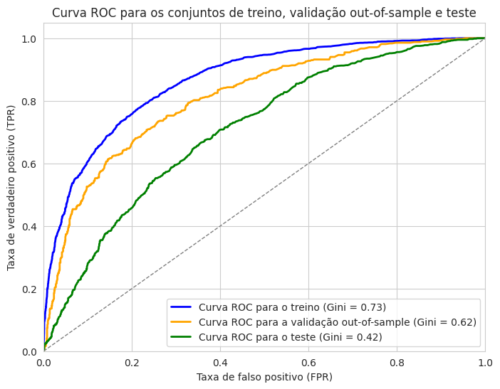

# Modelo de *Credit Scoring* - PicPay

## Objetivo

O objetivo deste desafio é construir um modelo de *Credit Scoring* para a base de dados fornecida, que contém 81 variáveis e 10.738 registros.

As variáveis `id`, `safra` e `y` correspondem, respectivamente, ao código identificador único do registro, o mês e ano de concessão do crédito e a indicação de inadimplência. As demais são variáveis independentes mascaradas.

A solução proposta para o desafio está no Jupyter Notebook [`case_picpay.ipynb`](case_picpay.ipynb). As configurações dos dados e da modelagem estão nos arquivos [`config/data.yaml`](config/data.yaml) e [`config/model.yaml`](config/model.yaml), respectivamente. Os modelos treinados estão salvos no diretório [`config/`](config/). O arquivo [`utils/utils.py`](utils/utils.py) contém funções auxiliares.

## Análise exploratória

Inicialmente, foi realizada análise apenas das variáveis `id`, `safra` e `y`, além da porcentagem de dados faltantes em todas as variáveis. Como há um número elevado de variáveis independentes e elas estão mascaradas, a análise de suas distribuições foi feita apenas para as principais variáveis do modelo.

### Variável de ID

A variável `id` foi avaliada para identificar possíveis duplicidades dentro da safra ou entre diferentes safras. Caso isso acontecesse, seria necessário garantir, pelo menos, que não houvesse repetições de IDs do treino no conjunto de teste. Entretanto, todos os IDs são únicos e nenhum tratamento adicional foi necessário.

### Distribuição das safras

Os dados foram obtidos ao longo dos 12 meses de 2014. Não há grande concentração em nenhum mês, conforme ilustrado na tabela abaixo.

| **Safra** | **%** |
|:---------:|:-----:|
|   201401  |  8,0  |
|   201402  |  8,4  |
|   201403  |  8,1  |
|   201404  |  8,9  |
|   201405  |  9,1  |
|   201406  |  8,4  |
|   201407  |  9,0  |
|   201408  |  8,5  |
|   201409  |  8,2  |
|   201410  |  8,7  |
|   201411  |  7,5  |
|   201412  |  7,3  |

### Taxa de inadimplência

A taxa de inadimplência geral é de 29,1%. A taxa ao longo das safras está ilustrada na Figura 1. A inadimplência é mais elevada no início e final do ano, o que pode ser um comportamento sazonal. Entretanto, seria necessário um histórico maior para confirmar tal hipótese.

| |
|:--:| 
| Figura 1: Taxa de inadimplência ao longo das safras. |

### Valores faltantes

As variáveis `id`, `safra` e `y` não possuem nenhum valor faltante. Das 78 variáveis restantes, 55 possuem 25% ou mais de *missing*, 38 possuem 50% ou mais e apenas 2 variáveis possuem mais de 75% de valores faltantes. As 10 variáveis com maior porcentagem de *missing* estão representadas na tabela abaixo.

| **Variável** | **% *missing*** |
|:------------:|:---------------:|
|    VAR_62    |       78,0      |
|    VAR_70    |       76,9      |
|    VAR_61    |       71,3      |
|    VAR_49    |       67,9      |
|    VAR_36    |       67,7      |
|    VAR_63    |       67,5      |
|    VAR_43    |       67,0      |
|    VAR_12    |       67,0      |
|    VAR_18    |       66,3      |
|    VAR_21    |       66,3      |

## Separação dos dados em conjuntos de treino, validação e teste

Apesar do aumento da inadimplência nos últimos meses da janela, por se tratar de um modelo que será aplicado de forma operacional, os 9 primeiros meses foram selecionados para treino e os 3 finais para teste. Foram obtidos os seguintes conjuntos.

* Treino: 80% dos 9 primeiros meses, usado para treinar o modelo e otimizar os hiperparâmetros.
* Validação: 20% dos 9 primeiros meses, usado como uma amostra *out-of-sample*.
* Teste: 3 últimos meses, usado como uma amostra *out-of-time*.

## Pré-processamento

Os dados faltantes foram preenchidos por meio do algoritmo SimpleImputer, usando a mediana da variável no conjunto de treino. Em seguida, os dados foram padronizados pelo algoritmo RobustScaler, que utiliza o intervalo interquartil para lidar com valores *outlier*.

Ambos os algoritmos foram treinados no conjunto de treino e, em seguida, aplicados nos conjuntos de validação e teste.

## Seleção de variáveis

As variáveis do modelo foram selecionadas com base nos critérios de estabilidade e multicolinearidade. Após aplicação dos filtros descritos a seguir nos dados pré-processados, foram mantidas 60 variáveis.

### Estabilidade

A estabilidade das variáveis foi avaliada por meio do Índice de Estabilidade Populacional (PSI, do inglês *Population Stability Index*), usando a primeira safra do treino (201401) como referência.

Utilizando um valor limite de PSI de 0,25, 7 variáveis foram consideradas instáveis e foram removidas.

### Multicolinearidade

Multicolinearidade é a presença de variáveis independentes altamente correlacionadas no conjunto de dados, o que significa que uma variável pode ser predita por outras variáveis com alta acurácia. Tal comportamento pode afetar negativamente o desempenho de algoritmos lineares e que dependem da estimativa de coeficientes, como regressão linear ou logística e SVM, por exemplo.

A multicolinearidade pode ser identificada pelo Fator de Inflação da Variância (VIF, do inglês *Variance Inflation Factor*), que é uma métrica que mede o tanto que uma variável pode ser prevista por um modelo de regressão que utiliza as demais variáveis como preditoras.

Utilizando um valor de VIF máximo de 15, 11 variáveis foram removidas.

## Modelagem

O algoritmo escolhido para o modelo de *Credit Scoring* foi o LightGBM, devido a uma série de fatores:

* Capacidade preditiva: identifica relações não lineares e normalmente tem resultados muito bons.
* Desempenho computacional: otimizado para conjuntos de dados grandes e normalmente é mais rápido que outros algoritmos de *gradient boosting*.
* Versatilidade: capaz de lidar nativamente com valores faltantes, variáveis em escalas diferentes e com dados desbalanceados, por exemplo.
* Interpretabilidade: apesar de o modelo não ser tão interpretável como modelos lineares ou árvores de decisão, ele pode ser facilmente interpretado usando SHAP, que possui um algoritmo específico para ensambles de árvores de decisão, como é o caso do LightGBM.

Como o LightGBM lida com dados faltantes nativamente e não é altamente sensível à escala das variáveis, ele foi treinado com os dados originais, sem pré-processamento. Além disso, foram feitos dois testes de modelo: um com as variáveis selecionadas pelos critérios de estabilidade e multicolinearidade e um com todas as variáveis explicativas.

O resultado final do modelo é um *score* no intervalo de 0 a 1.000 obtido a partir da probabilidade que o modelo estima para a ausência de inadimplência. Ou seja, quanto maior o *score*, menor é a probabilidade de inadimplência do cliente.

### Otimização de hiperparâmetros

Os hiperparâmetros do LightGBM foram otimizados pela biblioteca Hyperopt, que utiliza um algoritmo de otimização Bayesiana, o TPE. A escolha da melhor combinação foi feita com base na métrica AUC, utilizando validação cruzada *k-fold* com 10 *folds*.

### Modelo com seleção de variáveis.

A primeira versão do modelo utilizou os dados originais, sem pré-processamento, e as 60 variáveis selecionadas. A curva ROC está ilustrada na Figura 2.

| |
|:--:| 
| Figura 2: Curva ROC do modelo com seleção de variáveis. |

### Modelo com todas as variáveis

A segunda versão do modelo também utilizou os dados originais, porém com todas as 78 variáveis explicativas. A curva ROC está ilustrada na Figura 3.

| |
|:--:| 
| Figura 3: Curva ROC do modelo com todas as variáveis. |

## Interpretação dos resultados e comparação dos modelos

A métrica utilizada para avaliação dos modelos foi o Gini, que é uma transformação linear do AUC e assume valores no intervalo de -1 a 1. Valores próximos de 0 indicam um modelo sem poder discriminativo, enquanto um Gini de 1 indica um modelo perfeito. Valores negativos correspondem a um modelo pior que o aleatório e podem indicar inversão dos rótulos da variável resposta (o que realmente ocorre no modelo de crédito, uma vez que o *score* é construído a partir da probabilidade da classe 0; dessa forma, o sinal do Gini é invertido). A principal vantagem do AUC (e do Gini) em relação a outras métricas de avaliação de modelos de classificação, como acurácia, precisão e sensibilidade, é que ele é capaz de medir a capacidade do modelo de distinguir bons pagadores de maus pagadores, sem depender de um limiar de decisão binário.

A tabela abaixo consolida os Ginis de ambos os modelos nos conjuntos de treino, validação (out-of-sample) e teste (out-of-time).

| **Conjunto / modelo** | **Seleção de variáveis** | **Todas as variáveis** |
|-----------------------|:------------------------:|:----------------------:|
| Treino                |           0,73           |          0,73          |
| Validação             |           0,62           |          0,70          |
| Teste                 |           0,42           |          0,43          |

Conforme pode ser visto, ambos os modelos tiveram o mesmo desempenho no conjunto de treino, mas o Gini do modelo com seleção de variáveis no conjunto de validação teve uma grande queda, indicando *overfitting*, o que não é observado no modelo com todas as variáveis. Uma possível explicação para tal observação é a capacidade do LightGBM em lidar com variáveis correlacionadas. É possível que a seleção de variáveis esteja removendo informações relevantes e reduzindo o poder de generalização do modelo.

Em relação ao conjunto de teste, observa-se uma grande queda no Gini em ambos os modelos. Como não foi observado muito *overfitting* no conjunto de validação do modelo com todas as variáveis, é possível que o problema esteja nas distribuições do conjunto de teste, conforme já foi observado na taxa de inadimplência e será explorado em mais detalhes na próxima seção.

A Figura 4 mostra a estabilidade do Gini ao longo das safras. Observa-se um pouco de instabilidade, principalmente no conjunto de validação, com uma tendência geral de queda, indicando deterioração do desempenho. Conforme observado anteriormente, o Gini nas safras de teste é bem inferior às safras de treino e validação.

| |
|:--:| 
| Figura 4: Estabilidade do Gini nas safras. |

Além dos picos no início e final do ano, a Figura 1 também mostra uma tendência de aumento da inadimplência ao longo dos outros meses, o que poderia ajudar a explicar a deterioração do modelo.

Apesar da perda de desempenho de ambos os modelos no conjunto de teste, o modelo com todas as variáveis se mostrou mais robusto no conjunto de validação e foi selecionado para as análises subsequentes.

## Avaliação do modelo com todas as variáveis

### Importância das variáveis

A importância das variáveis do modelo foi avaliada por meio do SHAP. A Figura 5 mostra a contribuição das 10 variáveis mais importantes.

| |
|:--:| 
| Figura 5: Valores SHAP das 10 variáveis mais importantes. |

### Distribuição das 5 variáveis mais importantes

As Figuras 6 a 10 mostram a distribuição das 5 variáveis mais importantes do modelo. O lado esquerdo contém a distribuição geral de cada conjunto, enquanto o lado direito contém a média da variável ao longo dos meses. Em geral, as distribuições seguem um formato semelhante, com o conjunto de teste sendo mais distante dos outros. Esse comportamento também é observado nos valores médios.

| |
|:--:| 
| Figura 6: Distribuição da variável VAR_1. |

| |
|:--:| 
| Figura 7: Distribuição da variável VAR_9. |

| |
|:--:| 
| Figura 8: Distribuição da variável VAR_17. |

| |
|:--:| 
| Figura 9: Distribuição da variável VAR_27. |

| |
|:--:| 
| Figura 10: Distribuição da variável VAR_20. |

Foi realizado o teste de Kolmogorov-Smirnov (KS) para comparar a distribuição do treino com a validação e teste, usando um nível de significância de 0,05. Para todas as variáveis, houve diferença estatisticamente significativa entre as distribuições do treino e do teste.

Outra alternativa ao KS seria utilizar PSI para comparar os conjuntos. Apesar de não fornecer informação sobre significância estatística e depender de um ponto de corte definido de forma arbitrária, o PSI é mais fácil de interpretar do ponto de vista de negócio e pode ser menos sensível a pequenas alterações em conjuntos de dados muito grandes.

### Quantidade de valores faltantes nas 5 variáveis mais importantes

A tabela abaixo ilustra a porcentagem de valores faltantes nas 5 variáveis mais importantes nos conjuntos de treino, validação e teste, reforçando a maior distância do teste para os outros conjuntos.

| **Variável** | **Treino** | **Validação** | **Teste** |
|--------------|:----------:|:-------------:|:---------:|
| VAR_1        |    3,8%    |      3,6%     |    4,2%   |
| VAR_9        |    0,0%    |      0,0%     |    0,0%   |
| VAR_17       |    41,2%   |     41,4%     |   44,0%   |
| VAR_27       |    58,6%   |     59,2%     |   44,1%   |
| VAR_20       |    0,0%    |      0,0%     |    0,0%   |

## Conclusão

A análise exploratória dos dados revelou um possível comportamento sazonal na taxa de inadimplência e variações na distribuição das variáveis preditoras, o que pode levar a uma deterioração de um modelo preditivo ao longo do tempo.

A modelagem de *Credit Scoring* utilizou o LightGBM, um algoritmo com boa eficiência computacional, capaz de lidar com grandes volumes de dados, com classes desbalanceadas, dados faltantes e em diferentes escalas e com *outliers*. Dois modelos foram comparados: um com seleção de variáveis e outro usando todas as variáveis disponíveis. Os resultados indicaram que, apesar da seleção de variáveis reduzir o risco de utilizar informações instáveis e com multicolinearidade, a remoção de algumas informações pode ter comprometido a capacidade de generalização do modelo, resultado em *overfitting*.

Ambos os modelos tiveram queda significativa na métrica Gini no conjunto de teste, indicando que mudanças nas características dos dados ao longo do tempo impactaram sua capacidade preditiva.

Alguns dos problemas descritos podem ser resultantes do pequeno tamanho do conjunto de dados, mas a aplicação operacional do modelo requer uma análise contínua da distribuição das variáveis e da estabilidade da métrica de acerto. Estratégias como retreinos periódicos do modelo, treinamento em um histórico maior e utilização de validação cruzada estratificada pelo tempo, por exemplo, podem contribuir para a manutenção do modelo ao longo do tempo.
